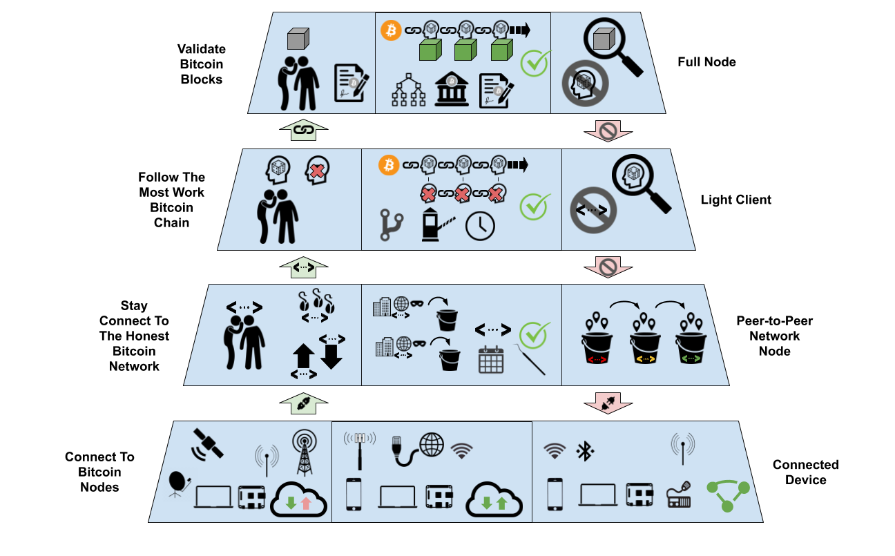

<!-- Copy and paste the converted output. -->

>>>>>  gd2md-html alert:  ERRORs: 0; WARNINGs: 1; ALERTS: 8.

<ul style="color: red; font-weight: bold"><li>See top comment block for details on ERRORs and WARNINGs. <li>In the converted Markdown or HTML, search for inline alerts that start with >>>>>  gd2md-html alert:  for specific instances that need correction.</ul>

Links to alert messages:
<a href="#gdcalert1">alert1</a>
<a href="#gdcalert2">alert2</a>
<a href="#gdcalert3">alert3</a>
<a href="#gdcalert4">alert4</a>
<a href="#gdcalert5">alert5</a>
<a href="#gdcalert6">alert6</a>
<a href="#gdcalert7">alert7</a>
<a href="#gdcalert8">alert8</a>

>>>>> PLEASE check and correct alert issues and delete this message and the inline alerts.

>>>>>  gd2md-html alert: inline image link here (to images/image1.png). Store image on your image server and adjust path/filename/extension if necessary.  (<a href="#">Back to top</a>)(<a href="#gdcalert2">Next alert</a>) >>>>> 

<h1>Low Bandwidth Bitcoin</h1>

How low can we go for mobile only users, and what are the trade-offs?

Richard Myers, [Global Mesh Labs](https://twitter.com/GlobalMeshLabs)

November 2, 2020

<h1>Introduction</h1>

There is a need to strengthen the Bitcoin ecosystem for people whose only computing device is a smartphone and who live where mobile Internet access is [expensive](https://a4ai.org/extra/mobile_broadband_pricing_gnicm-2019Q2), slow, unreliable or [censored](https://ooni.org/post/venezuela-blocking-wikipedia-and-social-media-2019/). Senegalese Bitcoin developer [Fodé Diop](https://www.coindesk.com/africa-bitcoin-developer-dakar-cypherpunk) has made the point that many parts of the world are “mobile only” not just “mobile first.”

Mobile wallet apps that allow users to retain control of their private keys for signing transactions, but do not act as a full Bitcoin node, are usually referred to as “light” clients. Light clients make trade-offs to privacy and trust minimization in order to reduce the memory, persistent storage and communication bandwidth they require. This article focuses on how to minimize the bandwidth used by light client wallets running on a mobile phone.

Light clients have much lower bandwidth requirements than full nodes because they do not download the full Bitcoin blockchain. Instead light clients use some form of “simple payment verification” ([SPV](https://en.bitcoinwiki.org/wiki/Simplified_Payment_Verification)) to confirm transactions. Rather than directly confirm the validity of every transaction added to Bitcoin’s ledger since the genesis block, an SPV wallet only confirms that the particular transactions associated with the wallet were added to a block, and that this block is part of the chain of blocks with the most work securing it. An SPV wallet assumes, but does not verify, that the majority of honest miners will only contribute work to extend the blockchain built from transactions that follow the consensus rules of Bitcoin.

In this technical discussion we examine the light client bandwidth requirements and the subtle security and privacy trade-offs that exist for light clients designed to operate with limited internet connectivity.

<h1>Light Client Trade-Offs</h1>

The most secure solution for users is to run and confirm payments with their own Bitcoin full node. However, there is some correlation between countries where people rely on relatively expensive or unreliable metered internet connectivity – where Bitcoin’s censorship resistance is most needed – and those where people are unlikely to have the technical or financial resources to run a Bitcoin full node. In many parts of the world, Bitcoin users will have no other option but to use online custodial bitcoin wallets due to bandwidth costs. Using a low bandwidth mobile-only light client can act as an intermediate step toward eventually running a dedicated full node.

An advantage of custodial bitcoin exchanges is that their risks to user privacy and funds are very similar to those of other trusted payment providers like Paypal and Western Union. Light client wallets require a more nuanced appreciation of the security and privacy trade-offs that come from using anonymous public nodes and complex peer-to-peer protocols.

There is also an argument that light clients can be harmful to the Bitcoin network generally. As more people run light clients it increases the bandwidth and computation requirements of the public full nodes that serve them. This can lead to a decrease in the number of public full nodes, especially those that serve information to light clients. If all light clients rely on a small set of public full nodes, their security and privacy can be compromised if those full nodes conspire against them.

We believe that the impact on the Bitcoin network can be minimized if light clients also exchange data directly with other light clients. The proliferation of light clients will eventually lead to more users running full nodes, especially in developing countries where connectivity is more expensive and personal computers aren’t in widespread use.

<h1>Network Layers</h1>

<h1>

>>>>>  gd2md-html alert: inline image link here (to images/image2.png). Store image on your image server and adjust path/filename/extension if necessary.  (<a href="#">Back to top</a>)(<a href="#gdcalert3">Next alert</a>) >>>>> 

</h1>

Light clients must support many of the same network protocol layers as Bitcoin full nodes. Both start by directly communicating with an initial set of Bitcoin nodes. From these initial nodes they exchange the addresses of other nodes that are part of the Bitcoin network. Both light clients and full nodes must also learn from their peers about the proof-of-work securing and connecting alternative blockchain tips back to the genesis block. Full nodes primarily differ from light clients in how they share information about transactions. Full nodes exchange information about transactions in blocks and independently validate that new blocks follow the consensus rules of Bitcoin. Light clients only confirm specific transactions are present in blocks confirmed by full nodes.

<h2>Connectivity</h2>

>>>>>  gd2md-html alert: inline image link here (to images/image3.png). Store image on your image server and adjust path/filename/extension if necessary.  (<a href="#">Back to top</a>)(<a href="#gdcalert4">Next alert</a>) >>>>> 

Unlike the fixed-cost wired internet connections typically used for full nodes, mobile phones use metered internet connections where transferring large amounts of data can be costly. Mobile phones also run off of batteries, which are used up faster when transferring data. They also can not take direct advantage of broadcast data feeds that require fixed satellite dishes or large radio antennas.

Mobile devices do have some resiliency and privacy advantages over nodes with fixed power and data connections. They can operate off-grid or during power outages and in some areas can purchase pre-paid internet subscriptions anonymously. Mobile devices can also gain privacy and censorship resistance by connecting to different local peers via ad-hoc networks as they move around.

Light clients made for mobile phones should allow users to configure how much mobile bandwidth to use and be aware of when data allocations are renewed or about to expire. Alternative unmetered local connections, like a WiFi hotspot, should be used opportunistically when available for bandwidth intensive tasks like downloading blocks to preserve metered bandwidth.

<h2>Peers</h2>

>>>>>  gd2md-html alert: inline image link here (to images/image4.png). Store image on your image server and adjust path/filename/extension if necessary.  (<a href="#">Back to top</a>)(<a href="#gdcalert5">Next alert</a>) >>>>> 

Both full nodes and light clients rely on a robust [peer discovery](https://developer.bitcoin.org/devguide/p2p_network.html?highlight=block%20headers#peer-discovery) process to ensure they connect to a diverse set of honest peer nodes. Bitcoin nodes initially connect to preset seed nodes but must always discover new peers in order to stay connected to the “honest” Bitcoin network. The Bitcoin Core full node software has developed robust heuristics to mitigate [eclipse attacks](https://inthemesh.com/archive/bitcoin-eclipse-attacks/) from malicious peers and disconnect from misbehaving nodes. Because peer addresses are only 30 bytes each, light clients can use the same heuristics as full nodes to frequently query multiple peers for new addresses.

The best way to prevent becoming isolated from the honest Bitcoin network is to maintain a large, persistent and diverse set of peer connections. To help preserve battery life, light client software should be careful to not wake up a mobile phone too often to gossip about peer addresses or perform other tasks. Light clients should synchronize with their peers at the same fixed time interval to minimize both battery use and peer disconnections. 

<h2>Block Headers</h2>

>>>>>  gd2md-html alert: inline image link here (to images/image5.png). Store image on your image server and adjust path/filename/extension if necessary.  (<a href="#">Back to top</a>)(<a href="#gdcalert6">Next alert</a>) >>>>> 

Both full node and light client security depends on the ability to discover the chain tip of the blockchain with the most work securing it. This process starts by querying all peers for the most recent [block headers](https://bitcoin.org/en/developer-reference#block-headers) they know of for the blockchain. A node may need to query its peers at different points to find the point when they first disagree about which chain fork is correct. Light clients should also validate the proof-of-work, timestamp, merkle root and previous header block hash of each block header they receive and ban peers that serve invalid block headers. Full nodes also validate headers before downloading blocks to prevent denial-of-service (DoS) attacks. 

Once the canonical chain tip is determined, a light client can sync block headers back to ensure the chain tip connects to the Bitcoin genesis block - approximately 50 MB of data. Some light clients using slow or metered connections might initially only load block headers back to a check-point instead of the genesis block. Full nodes should always sync all block headers. Users should be warned of the risk of accepting payments until the entire header chain has been checked. Light clients and full nodes must continue to download 80 byte block headers from each peer to stay in sync with the blockchain as it grows and also query multiple peers for block headers to ensure they are always following the current best block header chain.

Modern light client wallets can detect when a transaction they track appears in a block using [BIP-157](https://github.com/bitcoin/bips/blob/master/bip-0157.mediawiki) block filters. Like block headers, light clients also query their peers to determine the current tip of a filter header chain. BIP-157 light clients download 32 byte block filter headers per block to stay synced with the block filter header chain. In the case of a disagreement between peers about the correct filter header chain, light clients can download the corresponding block to determine which peer is following the right chain. Light clients should ignore block filter chains that include invalid headers and blacklist peers that serve invalid block or filter headers.

Block filters provide greater privacy than the deprecated [BIP-37](https://github.com/bitcoin/bips/blob/master/bip-0037.mediawiki) bloom filter system because light clients do not leak to a full node which transactions they are interested in. Block filters also scale better than bloom filters. Because only one block filter is generated per block, a full node only needs a constant amount of computation to serve multiple light client peers. Light clients themselves can also help relay block filters and gossip block filter headers to increase the number of light client peers each full node supports. 

A Light client requires at a minimum the block filters for blocks that might contain relevant transactions. Filters are approximately 15 KB per block, so for a transaction that takes 6 blocks (~1 hour) to confirm, a light client would need to download 90 KB of filter data to get an indication of which block the transaction appears in. In the case of a second layer protocol like the [Lightning Network](https://lightning.network/), the period to watch for a transaction would be open ended unless [Watchtowers](https://bitcoinops.org/en/topics/watchtowers/) are being used. Watchtowers are particularly useful for light clients on mobile devices both because they are likely to be offline for long periods of time and because they are bandwidth limited.

<h2>Transactions</h2>

<h3>Blocks-Only Full Node</h3>

>>>>>  gd2md-html alert: inline image link here (to images/image6.png). Store image on your image server and adjust path/filename/extension if necessary.  (<a href="#">Back to top</a>)(<a href="#gdcalert7">Next alert</a>) >>>>> 

To reduce bandwidth consumption, full nodes can be configured to use [blocks-only-mode](https://bitcoin.org/en/full-node#blocks-only-mode) to download full blocks, but not gossip about transactions. This is a safe and private way to confirm transactions and does not require block filters because every block is downloaded. A mobile client operating as a [pruned](https://bitcoin.org/en/release/v0.12.0#wallet-pruning) blocks-only full node would require up to 2 GB of download bandwidth per week. A mobile client with fast and inexpensive or unmetered Internet could operate in this mode to gain the security and privacy advantages of running a full node, but still support light client mode when bandwidth is metered or battery power is limited. The flexibility for a mobile light client to opportunistically operate as a blocks-only full node could help increase the number of full nodes in countries where personal computer usage is less common. Mobile blocks-only full nodes could also serve block filters to light clients without significantly increasing their own bandwidth usage.

<h3>Block Filter Light Client</h3>

>>>>>  gd2md-html alert: inline image link here (to images/image7.png). Store image on your image server and adjust path/filename/extension if necessary.  (<a href="#">Back to top</a>)(<a href="#gdcalert8">Next alert</a>) >>>>> 

The new BIP-157 block filter system downloads [stripped](https://bitcoin.stackexchange.com/a/91648) blocks of up to 1 MB only when a tracked transaction is detected in the chain of downloaded block filters. This is a big improvement over the 2 GB per week of bandwidth needed to watch for transactions with a blocks-only Bitcoin full node. Downloaded blocks can be used to validate block filters, invalidate block filter chains and disconnect from peers that share invalid filters. This creates a way for light clients to prevent invalid filter chains from propagating and makes it possible for light clients to share filter information with each other and reduce the load on full nodes. Light clients can query the entire set of full nodes for recent blocks, not just full nodes that serve block filters. This prevents leaking information about the transactions a light client is interested in and spreads the load among a larger set of full nodes.

Light clients that use BIP-157 block filters do not independently confirm that all transactions in a block adhere to Bitcoin’s consensus rules, but instead assume that the chain confirmed by the most hash power follows the correct rules. These nodes can be tricked into following a majority of miners who collude to adopt different spending rules. In a situation like the [SegWit2x](https://bitcoinmagazine.com/articles/2x-or-no2x-why-some-want-hard-fork-bitcoin-november-and-why-others-dont) contentious hard fork, a light client user could have been misled into accepting an invalid payment from a fork of the Bitcoin blockchain. Low bandwidth light client users are also more susceptible to a variety of eclipse attacks that are easier to covertly attempt than a miner led hard fork. Users of second layer protocols like the Lightning Network are also potentially vulnerable to low cost [time-dilation attacks](https://discrete-blog.github.io/time-dilation/).

<h3>Electrum Light Client</h3>

>>>>>  gd2md-html alert: inline image link here (to images/image8.png). Store image on your image server and adjust path/filename/extension if necessary.  (<a href="#">Back to top</a>)(<a href="#gdcalert9">Next alert</a>) >>>>> 

Another popular solution for lightweight devices is the Electrum client-server protocol. Instead of downloading block filters and blocks from full nodes to confirm transactions, an [Electrum](https://electrum.org/#download) light client wallet requests small [Merkle proofs](https://electrumx.readthedocs.io/en/latest/protocol-methods.html#blockchain-transaction-get-merkle) for specific transactions (referenced by a unique transaction ID) directly from one or more servers running the Electrum protocol. Because Electrum servers can log the exact transactions requested by each light client it is important that clients anonymize their requests using a [Tor onion service](https://blockstream.com/2020/06/16/en-esplora-and-other-alternatives-to-electrumx/#connect-to-the-blockstream-electrum-server) or similar. It is possible that many of the current public Electrum servers are operated by private chain surveillance companies for the purpose of gathering data to deanonymize Bitcoin transactions. An additional risk of relying on the Electrum server model is that server operators could maliciously withhold (censor) providing proofs for particular transactions which is more difficult to do under the BIP 157 model.

While there are many fewer public Electrum servers than Bitcoin full nodes, currently very few full nodes serve block filters to light clients. This is expected to change as BIP-157 block filter support has now been [merged](https://github.com/bitcoin/bitcoin/pull/18876) into the Bitcoin Core software. 

An Electrum based light client would require even less bandwidth than a block filter based light client because it does not need to download block filter headers, block filters or stripped full blocks to confirm transactions. Instead Electrum clients only need to request a Merkle proof of approximately 400 B to confirm each transaction.

<h1>Summary</h1>

The table below summarizes how much metered data would be used by a blocks-only full node, a block filter based light client and an Electrum based light client. As you can see in the summary, either kind of light client uses dramatically less bandwidth per week, than even a minimal blocks-only full node.   

<table>
  <tr>
   <td>
   </td>
   <td>Data Size
   </td>
   <td>Peers Queried
   </td>
   <td>Returned Values
   </td>
   <td>Blocks-Only Full Node
   </td>
   <td>Block Filter Light Client
   </td>
   <td>Electrum Light Client
   </td>
  </tr>
  <tr>
   <td>Peer Addresses
   </td>
   <td>30 B
   </td>
   <td>8
   </td>
   <td>1000
   </td>
   <td>234 KB
   </td>
   <td>234 KB
   </td>
   <td>234 KB
   </td>
  </tr>
  <tr>
   <td>Block Headers for Current Chain Tip
   </td>
   <td>80 B
   </td>
   <td>8
   </td>
   <td>1
   </td>
   <td>640 B
   </td>
   <td>640 B
   </td>
   <td>640 B
   </td>
  </tr>
  <tr>
   <td>Filter Headers for Filter Chain Tip
   </td>
   <td>32 B
   </td>
   <td>8
   </td>
   <td>1
   </td>
   <td>-
   </td>
   <td>256 B
   </td>
   <td>-
   </td>
  </tr>
  <tr>
   <td>Block Headers back to Genesis Block
   </td>
   <td>80 B
   </td>
   <td>1
   </td>
   <td>650,000
   </td>
   <td>50 MB
   </td>
   <td>50 MB
   </td>
   <td>50 MB
   </td>
  </tr>
  <tr>
   <td>New Block Headers (1 week)
   </td>
   <td>80 B
   </td>
   <td>8
   </td>
   <td>1008
   </td>
   <td>630 KB
   </td>
   <td>630 KB
   </td>
   <td>630 KB
   </td>
  </tr>
  <tr>
   <td>New Block Filters (1 week)
   </td>
   <td>15 KB
   </td>
   <td>1
   </td>
   <td>1008
   </td>
   <td>-
   </td>
   <td>15 MB
   </td>
   <td>-
   </td>
  </tr>
  <tr>
   <td>Blocks back to Genesis Block
   </td>
   <td>1 to 1.5 MB
   </td>
   <td>1
   </td>
   <td>650,000
   </td>
   <td>200 GB
   </td>
   <td>-
   </td>
   <td>-
   </td>
  </tr>
  <tr>
   <td>New Blocks (1 week)
   </td>
   <td>~2 MB
   </td>
   <td>1
   </td>
   <td>1008
   </td>
   <td>2 GB
   </td>
   <td>-
   </td>
   <td>-
   </td>
  </tr>
  <tr>
   <td>Blocks per Transaction
   </td>
   <td>1 MB
   </td>
   <td>1
   </td>
   <td>1
   </td>
   <td>-
   </td>
   <td>1 MB
   </td>
   <td>-
   </td>
  </tr>
  <tr>
   <td>Merkle Proofs per Transaction
   </td>
   <td>~400 B
   </td>
   <td>1
   </td>
   <td>1
   </td>
   <td>-
   </td>
   <td>-
   </td>
   <td>400 B
   </td>
  </tr>
  <tr>
   <td>Max Initial Sync
   </td>
   <td>
   </td>
   <td>
   </td>
   <td>
   </td>
   <td>200 GB
   </td>
   <td>50 MB
   </td>
   <td>50 MB
   </td>
  </tr>
  <tr>
   <td>Max Weekly
   </td>
   <td>
   </td>
   <td>
   </td>
   <td>
   </td>
   <td>2 GB
   </td>
   <td>15 MB
   </td>
   <td>630 KB
   </td>
  </tr>
  <tr>
   <td>Max Per Transaction
   </td>
   <td>
   </td>
   <td>
   </td>
   <td>
   </td>
   <td>-
   </td>
   <td>1 MB
   </td>
   <td>400 B
   </td>
  </tr>
</table>

<h1>Lightning</h1>

A mobile Lightning client could use a light client as described above for creating, closing, and monitoring Lightning channels. A mobile Lightning client could also reduce the bandwidth it uses to gossip about network routes and instead use local routing to [rendez vous](https://github.com/lightningnetwork/lightning-rfc/wiki/Rendez-vous-mechanism-on-top-of-Sphinx) or [trampoline](https://github.com/lightningnetwork/lightning-rfc/pull/654) Lightning nodes. Once a Lightning channel has been anchored on the Bitcoin blockchain, updates to the channel do not require internet access but only a direct peer-to-peer data connection to channel partners. Monitoring channels for breeches can be configured to match how often a light client has Internet access. The funding transaction for channels can also be periodically re-anchored/spliced if the bandwidth required for updating Watchtowers would be more expensive than a single onchain transaction. Negotiating channel updates direction with peers over a LAN or radio connection can also increase resiliency, reduce metered internet usage and increase privacy.

Users of layer 2 protocols like Lightning that monitor and react to channel breaches using light clients are potentially more vulnerable to low cost attacks such as [time-dilation](https://discrete-blog.github.io/time-dilation/) or [flood-and-loot](https://arxiv.org/pdf/2006.08513.pdf). A light client can not find out about breach transactions until they appear in a block because they do not gossip about pending transactions. Light clients may also be easier to eclipse if they rely on a small set of peers for block filters.

<h1>Examples</h1>

For these examples we describe how a light client could be used to send and receive both bitcoin payments onchain and using Lightning.

<h2>Onchain</h2>

To confirm a transaction has been received on the blockchain, a light client must complete the following steps:

1. Sync block headers to the current chain tip.
2. Sync block filter headers to the current chain tip.
3. Submit a transaction to a full node for inclusion in a block.
4. Sync block filters from the point the transaction is submitted to a full node.
5. Once a block filter matches the transaction, download the corresponding stripped block.

In this example we assume block headers and block filter headers have already been synced back to the genesis block. This requires 50 MB of data initially and about 1 MB per week thereafter to keep synchronized with the current chain tip from multiple peers. The amount of data needed to re-synchronize block headers (1) and block filter headers (2) to the current blockchain tip after some time offline depends on how recently this information has last been updated. 

Downloading block filters (4) to watch for a particular transaction depends on how fast the transaction confirms. There is a trade-off between paying low transaction fees and using more bandwidth to download block filters. An hour’s worth of block filters would require downloading only 90 KB of filter data. The largest fixed data cost for light clients is downloading a stripped block corresponding to the block filter which matches the transaction they are interested in. This requires up to 1 MB of block data per transaction. If multiple transactions of interest appear in the same block this would require only downloading one block.

Even users with expensive or slow mobile data should be able to confirm Bitcoin transactions from their mobile phone using this system if they can afford 1 MB of data per transaction and 1 MB per week to stay synchronized to the blockchain. 

“In regards to your estimates; If it can be implemented that would be relevant and the economics of it could drive more bitcoin users to self custody,” says developer [Emmanuel Ndangurura](https://twitter.com/endangurura) from Nairobi, Kenya.  Emmanuel notes that a data plan of 175 MB that does not expire, or a weekly bundle of 500 MB, can be purchased in Nairobi for only $0.5. Using the data estimates above, with only 175 MB a user could download a 50 MB app, synchronize block headers and still have data to send and receive payments in a private and self custodial way using block filters.

<h2>Lightning</h2>

A lightning node must perform the onchain steps outlined above to open channels, close channels and respond to channel breaches. They must also access an internet connection for the following:

6. Monitor for improper channel closes using one of the following techniques:
    1. Subscribe to and submit appointments to [watchtowers](https://bitcoinops.org/en/topics/watchtowers/) for each channel update
    2. Download block filters for the entire period Lightning channels are open.
7. Receive network topology gossip for source routing.
8. Negotiate the Lightning protocol directly with channel partners.

Unlike for onchain transactions, the Bitcoin network does not need to be accessed for every Lightning payment. Instead, light clients must access Bitcoin peers within a configurable window of time (eg. a week) to check their channel counterparty has not tried to fraudulently force close the channel using an older channel state. Ideally channel state monitoring could be performed when an unmetered connection is available. For situations where only expensive metered connectivity is available, using Watchtowers (6i) is superior for monitoring channel state. However, clients that do not independently monitor the blockchain (6ii) risk losing funds if their watchtowers do not react to channel breeches.

Watchtowers (6a) would require something on the order of 500 B per Lightning payment made by or routed through a peer to be sent to a watchtower via an Internet gateway.  This is much less than monitoring for breech transactions directly (6b) which requires downloading approximately 15 MB of block filter data per week. A channel can also be cooperatively closed or [re-anchored/spliced](https://lists.linuxfoundation.org/pipermail/lightning-dev/2018-October/001434.html) onchain before it’s monitoring window expires if that would be less expensive from a bandwidth or watchtower subscription cost standpoint.

Instead of gossiping about network topology (7), light clients should use private Lightning nodes and not route payments for others where bandwidth is expensive. Instead they should use trampoline routing or similar incremental routing techniques. This would decrease bandwidth usage at the expense of routing privacy. 

Actually negotiating a channel update (8) requires as little as 2 KB per payment made by the node or forwarded for a peer. Channel updates can be made between nodes on the same local network even when internet gateways are not available.

A mobile Lightning node would need 1 MB of bandwidth for each channel they create or close onchain. They would need 2 KB to negotiate each channel update and an additional 500 B to register each update with a watchtower or 15 MB per week to monitor the blockchain directly using block filters.

<h1>Conclusion</h1>

Mobile light clients can substantially increase the security of Bitcoin users that currently rely on custodial Bitcoin wallets. New block filter based light clients will allow users with as little as 2 MB of bandwidth per week to confirm onchain transactions. By using watchtowers, mobile Lightning nodes can perform many low-fee transactions without requiring any more metered bandwidth than current onchain transactions. Or Lightning nodes can use block filters to independently monitor the blockchain using less than 20 MB per week. Mobile light clients can also opportunistically take advantage of unmetered internet access to operate as pruned blocks-only full nodes in “mobile-only” parts of the world. We believe a focus on low bandwidth Bitcoin light clients will help bring the advantages of self custody to more of the world and to eventually lead to greater geographic diversity of Bitcoin full nodes.

Special thanks to [Karim Helmy](https://twitter.com/karimhelpme) and [Will Clark](https://twitter.com/willcl_ark) for useful discussions and for reading drafts of this article; thanks also to [Alejandro Machado](https://twitter.com/alegw) for his encouragement and review.
